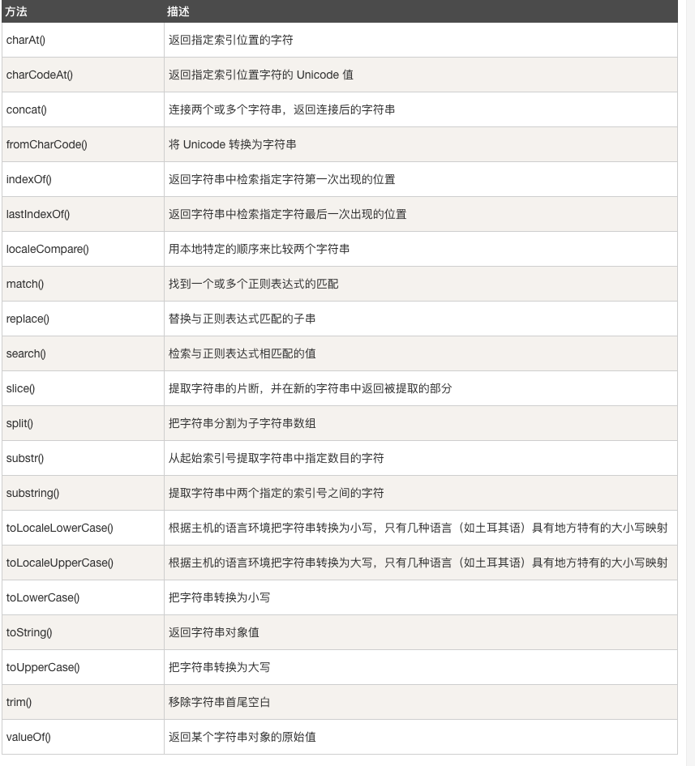

###樣板字面 */
/**樣板字面允許在字串嵌入運算式的字面字串值*/
const string1 = `string text`;
const string2 = `input string1 ${string1}`;

/**

* 跳脫符號
* 1. \0 -> 輸出空字元
* 2. \' -> 輸出單引號
* 3. \" -> 輸出雙引號
* 4. \\ -> 輸出反斜線
* 5. \n -> 換行
* 6. \r -> enter
* 7. \v -> 垂直制表
* 8. \b -> 退格
     */

/**存取字元: charAt() */
console.log("cat".charAt(0)); //output c
console.log("cat".charAt(1)); //output a
console.log("cat".charAt(2)); //output t

/**存取字元：用陣列索引的方式處理字串 */
console.log("cat"[0]); //output c
console.log("cat"[1]); //output a
console.log("cat"[2]); //output t

/**比較字串:strcmp() */
var a = "a";
var b = "b";
var c = "c";
if (a < b) {
console.log(a + "小於" + b); //output this conditions
} else if (a > b) {
console.log(a + "大於" + b);
} else {
console.log(a + "和" + b + "相等");
}

/**區分字串原始類型和String對象 */
var Abc = "Abc";
var String_object = new String(Abc);
console.log(`is string ${Abc} ${typeof Abc}`); //output (is string Abc string)
console.log(`is String object ${String_object} ${typeof String_object}`); //output (is String object Abc object)

/**字串與String對象在調用eval()函數時 不同的輸出 */
/**eval()計算以字串表示的javascript程式碼並傳回其完成值*/
var s1 = "2 + 2";
var s2 = new String("2 + 2");
console.log(eval(s1)); //output 4
console.log(eval(s2)); //output String {'2 + 2'}

/**通用方法 */
function use_strict() {
var i,
method = [
"quote",
"substring",
"toLowerCase",
"toUpperCase",
"charAt",
"charCodeAt",
"indexOf",
"lastIndexOf",
"startsWith",
"endsWith",
"trim",
"trimLeft",
"trimRight",
"toLocaleLowerCase",
"toLocaleUpperCase",
"localeCompare",
"match",
"search",
"replace",
"split",
"substr",
"concat",
"slice",
];
(methodCount = method.length),
(assignStringGeneric = function (methodName) {
var method = String.prototype[methodName];
String[methodName] = function (arg1) {
return method.apply(arg1, Array.prototype.slice.call(arguments, 1));
};
});
for (i = 0; i < methodCount; i++) {
assignStringGeneric(method[i]);
}
}

/**String.prototype.concat():將字串參數連接到該字串 並傳回一個新字串 */
const str1 = "hello";
const str2 = "world";

console.log(str1.concat(" ", str2));

/**String.prototype.endWith():檢查該字符串是否以某個字串作為結尾 回傳true and false */
const str3 = "dog are the best";
console.log(str3.endsWith("best")); //return true
console.log(str3.endsWith("dog")); //return false

/**String.prototype.includes():搜索該字串是否包含某個字串 搜索時會區分大小寫 回傳true and false */
const sentenct = "the quick brown fox jumps over the lazy dog";
const word = "fox";

console.log(
`the word "${word}" ${ sentenct.includes(word) ? "is" : "is not" } in the sentenct`
);

/**String.prototype.indexOf():搜索String該字串並傳回指定子字串第一次出現的索引位置 可選搜索起始位置  */
const paragraph = "i think ruth's dog is cuter than your dog";
const searchTerm = "dog";

console.log(
`ths index of the first "${searchTerm}" is ${paragraph.indexOf(searchTerm)}`
); //output 15

/**String.prototype.lastIndexOf():搜索String該字串並傳回指定子字串最後出現的索引位置 可選搜索起始位置 */
const lastparagraph =
"I think ruth dog is cuter than your dog,dog is very cute";
const searchlast = "dog";
console.log(
`index of the last ${searchlast} is ${lastparagraph.lastIndexOf(searchlast)}` //output 40
);

/**slice(value1,value2):分割字串 接收一個參數 並從該參數的索引位置(value1)進行分割 結束位置(value2 - 1) 返回一個子字串 */
let stringValue = "the dog so cute";
console.log(stringValue.slice(1, 10)); //output "he dog so"

/**substr(): */
let Str = "test substr() function";
console.log(Str.substring(3, 10));

